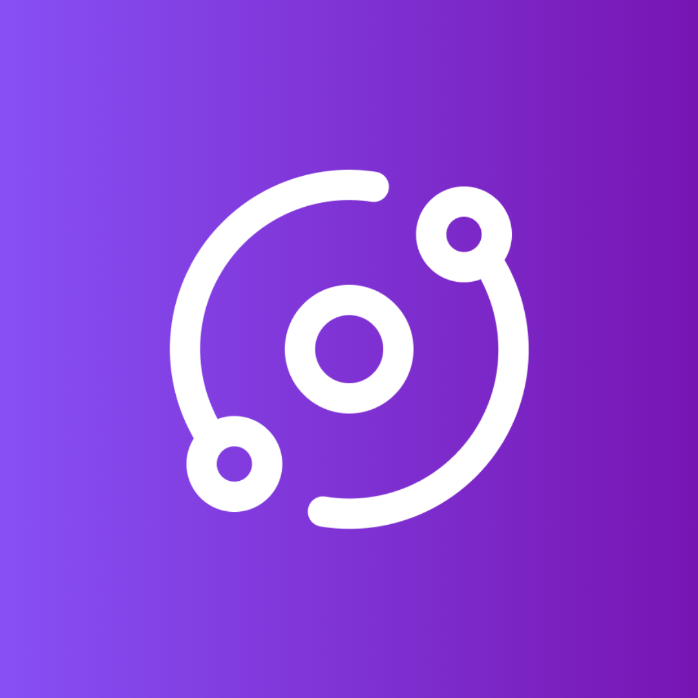

# Brio – A Nova Ágora Digital para o Conhecimento Colaborativo

 <!-- opcional: adicione o logo se houver -->

## Sumário
- [Brio – A Nova Ágora Digital para o Conhecimento Colaborativo](#brio--a-nova-ágora-digital-para-o-conhecimento-colaborativo)
  - [Sumário](#sumário)
  - [Introdução](#introdução)
  - [Visão e Propósito](#visão-e-propósito)
  - [Princípios Fundamentais](#princípios-fundamentais)
  - [Funcionalidades Essenciais](#funcionalidades-essenciais)
    - [Criação e Consumo de Conteúdo](#criação-e-consumo-de-conteúdo)
    - [Debates e Discussões](#debates-e-discussões)
    - [Revisão por Pares](#revisão-por-pares)
    - [Engajamento e Recompensas](#engajamento-e-recompensas)
    - [Feed Personalizado e Eventos](#feed-personalizado-e-eventos)
  - [Design e Experiência do Usuário](#design-e-experiência-do-usuário)
  - [Monetização e Sustentabilidade](#monetização-e-sustentabilidade)
  - [Identidade, Posicionamento e Valores](#identidade-posicionamento-e-valores)
  - [Estrutura Ampliada](#estrutura-ampliada)
    - [Fóruns e Comunidades](#fóruns-e-comunidades)
    - [Colaborações e Parcerias](#colaborações-e-parcerias)
    - [Recompensas Baseadas em Qualidade](#recompensas-baseadas-em-qualidade)
    - [Organização do Usuário e Perfis Personalizados](#organização-do-usuário-e-perfis-personalizados)
    - [Moderação e Posicionamento Político](#moderação-e-posicionamento-político)
  - [Biblioteca Integrada](#biblioteca-integrada)
  - [Narrativa e Motivação](#narrativa-e-motivação)
  - [Próximos Passos](#próximos-passos)

---

## Introdução
O **Brio** é uma plataforma open-source pensada para democratizar o conhecimento. Inspirado na Biblioteca de Alexandria e na Ágora grega, o Brio reúne pensadores, cientistas, estudantes e curiosos para compartilhar ideias, construir conteúdos colaborativamente e promover debates produtivos – sem os ruídos dos algoritmos das redes sociais tradicionais.

## Visão e Propósito
- **Visão:** Criar um espaço onde o conhecimento seja o centro, acessível e democrático, promovendo aprendizado colaborativo e debates construtivos.
- **Propósito:** Ser a moderna Biblioteca de Alexandria e Ágora digital, onde cada interação contribui para o crescimento e disseminação do saber.

## Princípios Fundamentais
- **Foco no Conhecimento:** Todas as discussões visam o aprendizado, o ensino e a exploração de ideias.
- **Colaboração:** Incentiva a troca de ideias, co-criação de conteúdos e revisão colaborativa.
- **Transparência:** Histórico de versões, sistemas abertos de revisão e regras claras para o convívio.
- **Ética:** Ambiente livre de preconceitos, desinformação e distrações irrelevantes.

## Funcionalidades Essenciais

### Criação e Consumo de Conteúdo
- **Criação intuitiva:** Permite posts em texto, vídeo, imagens e outros formatos – com auxílio de IA.
- **Versionamento:** Histórico completo de alterações, similar ao GitHub, garantindo transparência e colaboração.
- **Estudos Colaborativos:** Espaços para grupos desenvolverem projetos, artigos ou pesquisas em conjunto.

### Debates e Discussões
- **Fóruns Temáticos:** Organizados por áreas do conhecimento (ciência, filosofia, história, tecnologia etc.).
- **Moderação Eficiente:** Sistema para manter o foco das discussões e evitar desvios.
- **Votação Comunitária:** Upvote/downvote para destacar contribuições de alta qualidade.

### Revisão por Pares
- **Feedback Construtivo:** Publicações passam por revisões colaborativas para correção e aprimoramento.
- **Reconhecimento dos Revisores:** Destaque para quem contribui significativamente na melhoria do conteúdo.
- **Assistência de IA:** Suporte inteligente para detectar lacunas e sugerir melhorias.

### Engajamento e Recompensas
- **Pontuação e Badges:** Sistema que premia contribuições relevantes e de qualidade.
- **Benefícios Reais:** Recompensas simbólicas ou monetárias, acesso a eventos e destaque no perfil.

### Feed Personalizado e Eventos
- **Feed Dinâmico:** Conteúdos recomendados de acordo com os interesses do usuário.
- **Eventos de Conhecimento:** Debates, palestras, hackathons e outras iniciativas para fomentar o aprendizado e a colaboração.

## Design e Experiência do Usuário
- **Interface Limpa e Funcional:** Inspirada no Notion, Reddit e GitHub, focada na usabilidade.
- **Acessibilidade:** Design responsivo e inclusivo, com suporte a leitores de tela.
- **Perfis Personalizados:** Exibição do histórico de contribuições, interesses e conquistas do usuário.

## Monetização e Sustentabilidade
- **Anúncios Educacionais:** Publicidade alinhada ao propósito e à temática da plataforma.
- **Doações e Assinaturas:** Modelos para usuários que queiram apoiar o projeto e ter acesso a recursos avançados.
- **Parcerias Institucionais:** Colaborações com universidades, empresas e ONGs para financiar eventos e projetos.

## Identidade, Posicionamento e Valores
- **Nome e Slogan:**  
  - **Nome:** Brio  
  - **Slogan:** "Conhecimento, do povo, para o povo, pelo povo."
- **Mensagem Central:** Aprender é respeitar o caminho do conhecimento e colaborar para o avanço coletivo.
- **Compromisso Ético:** Combate a ideologias que promovam opressão e desigualdade, valorizando o saber e o debate construtivo.

## Estrutura Ampliada

### Fóruns e Comunidades
- **Fóruns Oficiais:** Criados pela equipe do Brio para temas amplos e fundamentais.
- **Fóruns Criados por Usuários:** Espaços de nicho moderados, com aprovação para garantir alinhamento com os valores da plataforma.

### Colaborações e Parcerias
- **Redes de Ensino e Governos:** Parcerias para concursos, bolsas de estudo e cursos acessíveis.
- **Iniciativas Comunitárias:** Oficinas, hackathons e desafios acadêmicos para engajar jovens e comunidades.
- **Apoio Institucional:** Espaços para universidades e instituições publicarem oportunidades, projetos e eventos.

### Recompensas Baseadas em Qualidade
- **Sistema Meritocrático:** Reconhecimento não pelo volume, mas pelo impacto e qualidade do conteúdo.
- **Indicadores de Qualidade:** Citações, aprovação por revisores e contribuição para debates construtivos.
- **Benefícios:** Badges, moedas virtuais, ingressos para eventos e destaque no perfil.

### Organização do Usuário e Perfis Personalizados
- **Espaço de Trabalho Pessoal:** Ferramentas para organizar estudos, projetos e rascunhos, com versionamento semelhante ao GitHub.
- **Perfis Customizáveis:** Exibição de conquistas, medalhas e portfólio acadêmico.

### Moderação e Posicionamento Político
- **Regras Claras de Conduta:** Políticas rigorosas contra discurso de ódio e conteúdos prejudiciais.
- **Moderação Transparente:** Sistema de denúncias e revisão para manter um ambiente seguro e produtivo.
- **Posicionamento Ético:** Combate a ideologias que promovam fascismo, opressão ou desigualdade.

## Biblioteca Integrada
- **Coleção Ampla:** Livros acadêmicos, técnicos e literários disponíveis gratuitamente.
- **Publicação e Atualização de Livros:** Usuários podem publicar e atualizar obras, mantendo um histórico de versões.
- **Anotações Personalizadas:** Ferramenta para fazer anotações diretamente nos livros e organizar insights.
- **Áudio-livros:** Versões em áudio integradas com o texto, garantindo acessibilidade e versatilidade.
- **Ferramentas de Pesquisa:** Busca avançada por palavras-chave e trechos para facilitar a consulta e citação.

## Narrativa e Motivação
> "Sempre amei escrever, compartilhar ideias e mergulhar em debates profundos. Porém, vi ideias valiosas se diluírem em plataformas caóticas, onde o conteúdo relevante era ofuscado por algoritmos. Foi dessa frustração que nasceu o Brio – um espaço colaborativo, onde o conhecimento se transforma num legado vivo, aprimorado por cada contribuição."  
>  
> **O que é o Brio?**  
> É a plataforma que une a criação colaborativa do Notion, o versionamento transparente do GitHub, a energia dos debates do Reddit e a credibilidade das revisões por pares – tudo turbinado pela inteligência artificial.  
>  
> **Por que o Brio existe?**  
> Para que cada conteúdo, seja um artigo, TCC ou livro, seja uma peça viva do conhecimento que evolui com a colaboração de mentes curiosas e apaixonadas pelo saber.

## Próximos Passos
- **MVP Previsto:** Lançamento até o final do ano.
- **Open-Source:** Contribua e colabore no [GitHub](https://github.com/ompo-dev/Brio).
- **Evolução Contínua:** Feedback da comunidade e atualizações constantes para aprimorar a plataforma.
- **Nome Placeholder:** "Brio" é o nome atual, mas pode ser ajustado conforme o projeto evolui.

---

Qualquer dúvida ou sugestão, sinta-se à vontade para abrir uma _issue_ ou enviar um _pull request_.

Happy Coding!  
Equipe Brio